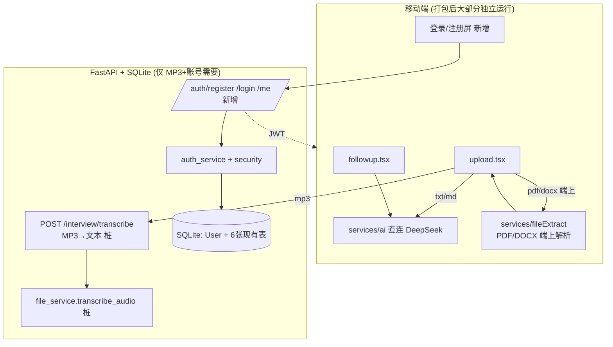

# Design Document

## Overview

本设计把三条产品建议落成具体的后端 + 前端改动。核心约束:**混合链路 + 文件解析分治**——文本类 AI 生成留在 App 端直连 DeepSeek;**PDF/DOCX 解析在 App 端上完成**;**MP3 转写与账号体系走后端**(FastAPI + SQLite)。

三条相互独立,可分批落地。建议顺序:**多格式上传 → 账号 → 追问优化**(已按此组织任务)。本设计对「先流出接口」的部分(尤其 MP3 ASR)只定**契约与桩**,实现细节标注「后续单独议」。

> 分治理由(2026 RN 生态核实结果):PDF 有原生模块 `expo-pdf-text-extract`、DOCX 是 zip+XML 可纯 JS 解,端上代价小且保 App 独立;MP3 端上跑 Whisper 在中文面试录音场景代价大(APK 体积、推理慢、中文精度不稳),故走后端云 ASR。

## Steering Document Alignment

### Technical Standards (.claude/CLAUDE.md)

- **数据层 = SQLite,锁定**:`User` 表照现有 `db/models.py` 的 SQLModel 范式落本地 SQLite;`db/supabase_client.py` 保持占位。字段对齐 Supabase Auth(email / 预留 external id),为云端阶段平滑迁移,但**本轮不接 Supabase、不写云端**。
- **schema 即契约**:新增/改动 `schemas/*.py` 与前端 `types/domain.ts` 对齐;snake_case ↔ camelCase 由 `services/*Api.ts` 封装层转换。
- **密钥安全**:JWT secret 与第三方 key 只进 `apps/api/.env`;`.env.example` 加占位。
- **Skill 边界**:supabase skill 本轮仅作「迁移目标参考」(给 User 表字段建议),不主导建库;agent-sdk-dev 不动(本轮不改 AI SDK 调用模式)。

### Project Structure

- 后端延续分层:`api/routes/`(路由,无业务逻辑)→ `services/`(业务)→ `db/`(持久化)。新增 `routes/auth.py`、升级 `services/file_service.py`、新增 `services/auth_service.py`、`core/security.py`。
- 前端延续:屏幕调 `services/*Api.ts`,AI 编排在 `services/ai/`,跨屏状态在 `store/useAppStore.ts`,设计 token 用 `constants/theme.ts`。

## Code Reuse Analysis

### Existing Components to Leverage

- **`core/errors.py`(统一错误信封)**:解析端点、鉴权端点的错误都走现有 `register_exception_handlers` + HTTPException,保持前端错误解析一致。
- **`core/config.py`(pydantic-settings)**:新增 `jwt_secret`、`jwt_expire_minutes`、`max_upload_mb` 等配置项,沿用 `.env` 锚定方式。
- **`db/database.py`(engine + init_db)**:`User` 表注册进现有 `SQLModel.metadata`,`init_db()` 幂等建表,无需新机制。
- **`mock_state.py` 的 user_id 范式**:explore/interview 各 `save_*/get_*` 已接受 `user_id` 参数(默认 `DEV_USER_ID`),账号接入只需在路由层把 token 解出的 `user_id` 透传进去,**改动面比想象小**。
- **`services/ai/index.ts` + `prompts.ts`(前端 AI 编排)**:追问优化主要改这两处的 prompt 与返回处理。
- **`app/explore/followup.tsx`(追问屏)**:已是多轮对话 + history 机制,承接语只需新增一处渲染。
- **`utils/prompts.py`**:后端追问 prompt 同步改动点。

### Integration Points

- **DeepSeek 直连(`deepseekClient.ts`)**:追问优化复用现有 `chatJson`(JSON Output 模式),只改 prompt 与解析,无需改传输层。
- **上传流程(`upload.tsx` → `interviewApi.uploadInterview`)**:PDF/DOCX 端上解析、MP3 后端转写都发生在拿到 `transcript` 之前;拿到 text 后原有上传/生成流程零改动。
- **DB(SQLite)**:`User` 表与现有 6 张表共库;explore/interview 表的 `user_id` 列已存在,只是值从 `dev-user` 变为真实 id。

## Architecture

### 三条功能的链路归属



### Modular Design Principles

- **端上解析**:`services/fileExtract/index.ts` 按扩展名分发到 `extractPdf / extractDocx`(txt/md 仍走现有 FileReader),每个纯函数单一职责。
- **后端转写桩**:`file_service.transcribe_audio(content)` 本轮抛 `NotImplementedError`,只留契约。
- **鉴权分层**:`core/security.py`(密码哈希 + JWT 编解码,无业务)←`services/auth_service.py`(注册/登录业务)←`routes/auth.py`(HTTP)。
- **追问承接语**:作为可选字段,前后端都「有则用、无则降级」,不破坏旧路径。

---

## Components and Interfaces

### Component 1 — 多格式上传解析(Requirement 1,分治)

**Purpose:** 把上传文件转成纯文本 `transcript`。PDF/DOCX 端上解析,MP3 走后端转写桩,txt/md 沿用现有端上读取。

#### 1A. 前端端上解析 `apps/mobile/services/fileExtract/`(新增)

```typescript
// index.ts —— 按扩展名分发
export async function extractFileText(file: PickedFile): Promise<ExtractOutcome>
//   txt/md  → 现有 FileReader 路径(沿用)
//   pdf     → extractPdf(uri)     —— expo-pdf-text-extract 原生模块
//   docx    → extractDocx(bytes)  —— fflate 解 zip + 取 word/document.xml 文本
//   mp3     → 交给 interviewApi.transcribeAudio()(走后端,见 1B)
//   其它    → { ok:false, reason:"unsupported" }

// ExtractOutcome = { ok:true, text, sourceFormat } | { ok:false, reason }
```

- **extractPdf**:用 `expo-pdf-text-extract`(2026,原生抽文本层)。原生模块在 Expo Go/web 不可用 → 捕获并返回 `{ ok:false, reason:"native_unavailable" }`,上层降级提示。
- **extractDocx**:docx = zip;用 `fflate` 解压取 `word/document.xml`,正则/轻解析剥 XML 标签得正文。纯 JS,无原生依赖。
- 空文本(扫描件无文本层等)→ `{ ok:false, reason:"empty" }`,提示换文件/粘贴。

**Interfaces:** `extractFileText(file) -> ExtractOutcome`;`extractPdf`、`extractDocx` 子函数。
**Dependencies:** `expo-pdf-text-extract`(原生,需 prebuild/EAS)、`fflate`(纯 JS)。
**Reuses:** 现有 `upload.tsx` 的 `useFilePicker`;`expo-document-picker`(真机选文件,当前 web-only,需补真机选择)。

#### 1B. 后端 MP3 转写端点 + 桩

**新增路由** `apps/api/app/api/routes/interview.py`:
```
POST /interview/transcribe
  请求: multipart/form-data, 字段 file (UploadFile, .mp3)
  响应(将来): TranscribeResponse { text: str, warnings: list[str] }
  本轮: 501 + 明确「语音转写暂未支持」错误信封
```

**升级 `services/file_service.py`**(只加 MP3 桩,不做 PDF/DOCX):
```python
def transcribe_audio(content: bytes, filename: str) -> TranscribeResult:
    # 仅留接口桩:本轮不做真实 ASR。将来接云 ASR(讯飞/阿里/腾讯/火山/Whisper-server),key 只进 .env。
    raise NotImplementedError("mp3 语音转写暂未支持")
```

**Interfaces:** `transcribe_audio(content, filename) -> TranscribeResult`。
**Dependencies:** 本轮无新增后端依赖(桩);将来按选定 ASR 加。
**Reuses:** `core/errors.py` 错误信封;`schemas/interview.py` 加 `TranscribeResponse`;`core/config.py` 加 `max_upload_mb`。

> **「先流出接口」的含义**:`/interview/transcribe` 端点签名 + `transcribe_audio` 桩本轮定下、链路打通(上传 mp3 能拿到明确的 501),真实 ASR 选型与接入作为后续独立工作。原 `store_upload_metadata`(no-op)保留,不影响现有上传。

### Component 2 — 账号 / 鉴权(Requirement 2)

**Purpose:** 注册、登录、识别 user_id,替代写死的 `DEV_USER_ID`。

**新增 `core/security.py`:**
```python
def hash_password(raw: str) -> str
def verify_password(raw: str, hashed: str) -> bool
def create_access_token(user_id: str) -> str          # JWT, 含 sub=user_id + exp
def decode_access_token(token: str) -> str | None     # 返回 user_id 或 None
```

**新增 `services/auth_service.py`:**
```python
def register(email, password, nickname) -> User       # 唯一性校验 + 哈希 + 落库
def authenticate(email, password) -> User | None       # 校验密码哈希
def get_user(user_id) -> User | None
```

**新增 `routes/auth.py`:**
```
POST /auth/register  { email, password, nickname } -> { token, user: {id, nickname, email} }
POST /auth/login     { email, password }            -> { token, user }
GET  /auth/me        (Bearer token)                 -> { id, nickname, email }
```

**鉴权依赖(FastAPI Dependency):** `get_current_user_id(authorization) -> str`,解 Bearer token 得 user_id;无效/过期抛 401。explore/interview 路由可逐步接入此依赖,把 user_id 透传给 `mock_state.*`。

**Interfaces:** 上述三层函数 + 一个 FastAPI 依赖。
**Dependencies:** `python-jose[cryptography]`(JWT)、`passlib[bcrypt]`(哈希);`core/config.py` 新增 `jwt_secret` 等。
**Reuses:** `db/database.py` engine;`mock_state` 现有 `user_id` 形参(只需路由透传)。

**user_id 贯通策略(渐进、不破现状):**
- 第一步:auth 端点 + User 表 + security,可注册/登录/拿 token。
- 第二步:explore/interview 路由加**可选** `get_current_user_id` 依赖——带 token 用真实 id,不带 token 回退 `DEV_USER_ID`。这样后端对「未登录的旧调用」仍兼容,不会一刀切打断现有 mock 链路。

### Component 3 — 追问「随回答而动」(Requirement 3)

**Purpose:** 让追问处理跑题/答非所问/反问,并加「承接语」让对话连贯。

**改 prompt(两处同步):**
- 前端 `services/ai/prompts.ts` 的 `FOLLOWUP_SYSTEM_PROMPT` + `buildFollowupJsonPrompt` + `FOLLOWUP_JSON_EXAMPLE`(**打包后实际生效**)。
- 后端 `utils/prompts.py` 的 `FOLLOWUP_SYSTEM_PROMPT` 等(保持对齐)。

prompt 新增策略条款:
1. 回答跑题/无关 → 先温和拉回或换问法重问,不直接抛新问题。
2. 回答信息量过低(「不知道」「随便」)→ 换更具体、更易答的角度重问。
3. 用户反问 → 先一句简短回应,再引导回追问。
4. 输出新增 `reply`(承接语)字段:对用户上一句的简短回应(≤30 字),可空。

**输出 schema 变化(JSON Output 示例同步):**
```json
{
  "reply": "听起来你更在意能快速看到成果，对吗？",
  "question": {"id": "work-proof", "question": "那你做过的事里，哪件最快看到结果？"},
  "done": false
}
```

**前端处理(`services/ai/index.ts` `aiGenerateFollowup`):** 解析时把 `reply` 一并取出返回;`FollowupResponse` 类型加可选 `reply?: string`。
**前端渲染(`followup.tsx`):** AI 气泡在 `question` 上方/内显示 `reply`(有则渲染)。
**Reuses:** `deepseekClient.chatJson`(不改);现有多轮 history、6 轮硬上限、mock 回退全部保留。

---

## Data Models

### User(新增,`apps/api/app/db/models.py`)

```
class User(SQLModel, table=True):
  __tablename__ = "users"
  id: str            # 主键, uuid 字符串(对齐 Supabase auth.users.id 的 uuid 形态)
  email: str         # 唯一索引
  password_hash: str # bcrypt/argon2 哈希
  nickname: str
  created_at: datetime
  updated_at: datetime
```
- `id` 用 uuid 字符串而非自增 int:对齐 Supabase Auth 的 uuid 主键,日后迁移时 explore/interview 表的 `user_id` 外键语义不变。
- 现有 6 张表的 `user_id` 列**结构不变**,只是运行时值从 `"dev-user"` 变为真实 uuid。

### TranscribeResponse(新增,`apps/api/app/schemas/interview.py`)

```
class TranscribeResponse(CamelModel):
  text: str                       # 转写出的纯文本(将来 ASR 产出;本轮端点返回 501 不产出)
  warnings: list[str] = []        # 转写告警
```

### ExtractOutcome(前端,`apps/mobile/services/fileExtract/index.ts`)

```
type ExtractOutcome =
  | { ok: true; text: string; sourceFormat: "txt"|"md"|"pdf"|"docx" }
  | { ok: false; reason: "unsupported"|"empty"|"native_unavailable"|"backend_unsupported"|"error" }
```

### Auth schemas(新增,`apps/api/app/schemas/auth.py`)

```
class RegisterRequest(CamelModel): email; password; nickname
class LoginRequest(CamelModel):    email; password
class AuthUser(CamelModel):        id; nickname; email
class AuthResponse(CamelModel):    token; user: AuthUser
```

### FollowupResponse(改,前端 `services/ai/index.ts` / `exploreApi.ts`)

```
type FollowupResponse = {
  reply?: string;                 // 新增:承接语,可选
  question: FollowupQuestion | null;
  done: boolean;
}
```

### 前端 types/domain.ts

- 新增 `AuthUser` 类型;`InterviewUpload` 不变(仍以 `transcript` 为最终输入)。
- store 新增登录态(`authToken` / `currentUser`),「我的」页昵称读 `currentUser.nickname`。

---

## Error Handling

### Error Scenarios

1. **上传不支持的格式(如 .pages)**
   - **Handling:** 端上 `extractFileText` 返回 `{ ok:false, reason:"unsupported" }`。
   - **User Impact:** 上传屏提示「暂支持 txt/md/pdf/docx,mp3 即将支持」,保留手动粘贴。

2. **mp3 上传(本轮)**
   - **Handling:** App 调后端 `/interview/transcribe`,后端 `transcribe_audio` 抛 `NotImplementedError` → 501 + 明确文案;App 收到映射为 `backend_unsupported`。
   - **User Impact:** 「语音转写功能即将上线,当前可先上传文本或粘贴」。

3. **PDF/DOCX 端上解析出空文本(扫描件无文本层等)**
   - **Handling:** `extractFileText` 返回 `{ ok:false, reason:"empty" }`(本轮不做端上 OCR)。
   - **User Impact:** 「未能从文件中提取到文字,请换文件或直接粘贴」。

4. **PDF 原生模块在当前环境不可用(Expo Go / web)**
   - **Handling:** `extractPdf` 捕获原生模块缺失 → `{ ok:false, reason:"native_unavailable" }`。
   - **User Impact:** 「该格式需在正式 App 内使用,或直接粘贴文本」,不崩溃。

5. **MP3 超大文件**
   - **Handling:** 后端按 `max_upload_mb` 拒绝 → 413/422。
   - **User Impact:** 「文件过大,请压缩或截取关键片段」。

6. **注册邮箱已存在**
   - **Handling:** `auth_service.register` 查唯一性 → 抛冲突 → 409/统一错误码。
   - **User Impact:** 「该邮箱已注册,请直接登录」。

7. **登录失败(用户不存在 or 密码错)**
   - **Handling:** 统一返回鉴权失败,不区分原因(防枚举)。
   - **User Impact:** 「邮箱或密码不正确」。

8. **JWT 无效/过期**
   - **Handling:** 鉴权依赖抛 401。
   - **User Impact:** 前端清登录态、跳登录屏。

9. **JWT secret 未配置**
   - **Handling:** 启动期校验缺失即报错,绝不用硬编码默认。
   - **User Impact:** 部署者在日志看到明确配置提示(对终端用户不可见)。

10. **AI 追问调用失败/超时**
   - **Handling:** 沿用现有 `try/catch` → 本地 mock 题库回退;`reply` 缺失则只渲染问题。
   - **User Impact:** 对话不卡死,体验降级但不中断。

## Testing Strategy

> 仓库现状:移动端唯一自动化校验是 `npm run typecheck`;后端无测试框架(`.claude/CLAUDE.md` 提到 `python -m pytest` 待按需引入)。本 spec 不强行引入大测试体系,以「最小可验证」为准。

### Unit Testing

- **前端 fileExtract**:对 docx 小样本断言 `extractDocx` 返回非空文本;空内容样本断言 `{ ok:false, reason:"empty" }`;PDF 原生模块缺失时断言降级为 `native_unavailable`(可 mock 原生模块)。
- **后端 file_service**:`transcribe_audio` 断言抛 `NotImplementedError`。
- **core/security**:`hash_password`/`verify_password` 往返;`create/decode_access_token` 往返 + 过期 token 解码返回 None。
- 若后端引入 pytest,放 `apps/api/tests/`;否则用 `smoke_test.py` 同款手测脚本验证。

### Integration Testing

- **MP3 端点**:对运行中的 uvicorn 用 `/docs` 或脚本 POST 一个 mp3,验证返回 501 + 错误信封。
- **鉴权流**:register → login → 带 token 调 `/auth/me` 与一个 explore 端点,验证 user_id 正确贯通;不带 token 验证回退 `DEV_USER_ID` 仍可用。

### End-to-End Testing(前端,手动)

- 上传屏:**正式构建(prebuild/EAS)** 选 pdf/docx → 端上解析文本回填 → 走完复盘;mp3 → 看到明确提示;Expo Go/web 选 pdf → 看到「需正式 App」降级提示不崩。
- 追问屏:故意答非所问 → 观察 AI 是否拉回 + 承接语是否出现;断网 → 回退 mock 不卡死。
- 登录/注册屏:注册 → 登录 → 「我的」页显示真实昵称。
- 全程 `npm run typecheck` 通过。
