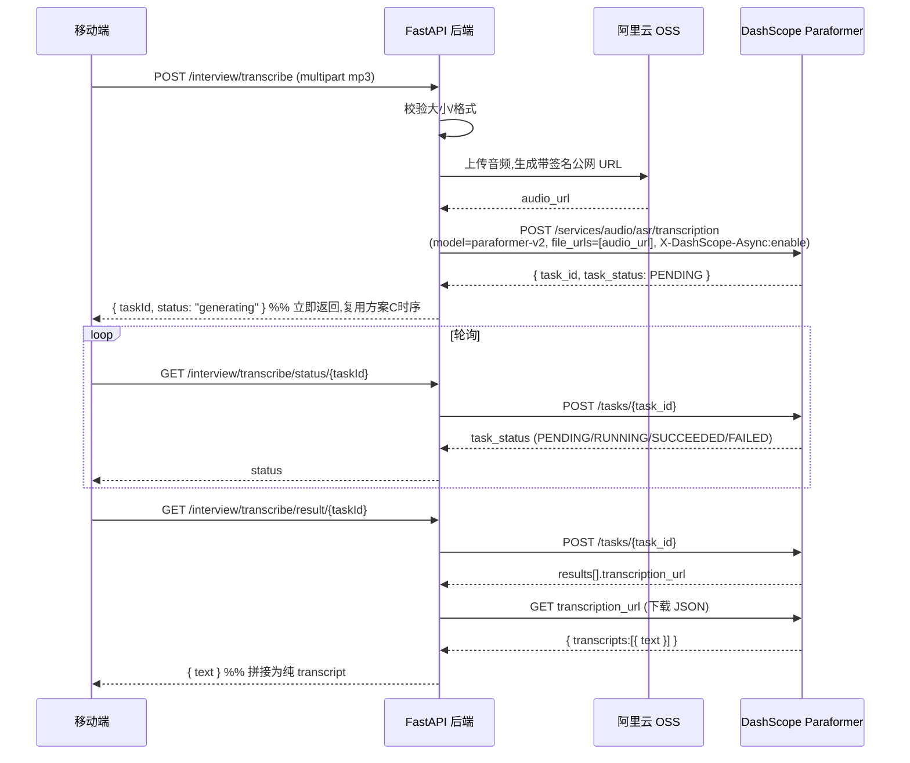

# MP3 语音识别(阿里云 Paraformer)— 设计与接口规格

> 状态:**接口写实、代码留桩**。本轮 `/interview/transcribe` 返回 501;本文把阿里云 Paraformer 的完整接法、异步时序、依赖与错误处理写全,作为后续填实现的权威依据。属主 spec `backend-feature-optimization` 的 Group A(MP3 分支)的展开。

## Overview

面试录音(mp3)转文字。经核实阿里云百炼(Model Studio)官方文档(2026),**Paraformer 录音文件识别 RESTful API 只接受公网可访问的音频 URL**,不收二进制流、不收 Base64、不收本地文件。因此后端必须先把用户上传的音频放到一个公网可达的存储(阿里云 OSS),拿到 URL,再交给 Paraformer 异步识别,轮询取结果。

**模型选型**:`paraformer-v2`(中文 + 多语种,支持 `language_hints:["zh"]`,适合中文面试录音)。

## 关键约束(来自官方文档,决定架构)

1. **只收公网 URL**:`input.file_urls` 必须是 HTTP(S) 可下载的 URL;单次请求仅支持 1 个 URL。→ **必须有对象存储中转**。
2. **异步任务制**:提交任务拿 `task_id` → 轮询 `GET /tasks/{task_id}` → `SUCCEEDED` 后拿 `transcription_url` → 下载 JSON 取文本。出结果「通常数分钟」,音频越长越久。
3. **鉴权**:DashScope API Key,`Authorization: Bearer {key}`;支持 60s 临时 token。
4. **计费**:按「被识别为语音的时长」计(非语音不计费);多音轨各自独立计费。单价以阿里云定价页为准。
5. **OSS 临时 URL 限制**:RESTful 支持 `oss://` 临时 URL,但「有效期 48h、文件上传凭证接口限流 100QPS、勿用于生产」。→ 生产用正经 OSS 桶 + 签名 URL。

## 完整链路(目标实现)



> 时序刻意对齐现有「方案 C」:面试报告生成就是「提交→立即返回 generating→前端轮询 status→ready 取结果」。MP3 转写复用同款,前端轮询逻辑、loading 态可大量复用。

## 待实现接口(本轮定签名,实现留桩)

### 后端端点 `apps/api/app/api/routes/interview.py`

```
POST /interview/transcribe
  请求: multipart/form-data, file (UploadFile, .mp3)
  本轮: 501 「语音转写暂未支持」
  目标: { taskId, status }  (提交成功)

GET /interview/transcribe/status/{task_id}
  目标: { taskId, status }  (PENDING|RUNNING|SUCCEEDED|FAILED → 映射 generating/ready/failed)

GET /interview/transcribe/result/{task_id}
  目标: TranscribeResponse { text, warnings }
```

### 服务层 `apps/api/app/services/file_service.py`(本轮桩)

```python
def transcribe_audio(content: bytes, filename: str) -> TranscribeResult:
    raise NotImplementedError("mp3 语音转写暂未支持")
```

### 目标实现(后续填):拆为可测的小函数

```python
# services/asr_service.py(将来新增)
def upload_to_oss(content: bytes, filename: str) -> str:        # 返回带签名公网 URL
def submit_transcription(audio_url: str) -> str:                # 返回 task_id
def query_task(task_id: str) -> TaskStatus:                     # 轮询状态
def fetch_result_text(transcription_url: str) -> str:           # 下载 JSON 拼纯文本
def transcribe(content, filename) -> str:                       # 编排上面四步
```

## 阿里云 API 细节(实现时照抄)

### 提交任务

```
POST https://dashscope.aliyuncs.com/api/v1/services/audio/asr/transcription
Headers:
  Authorization: Bearer {DASHSCOPE_API_KEY}
  Content-Type: application/json
  X-DashScope-Async: enable          # 必须,否则无法提交
Body:
  {
    "model": "paraformer-v2",
    "input": { "file_urls": ["<公网音频URL>"] },   # 单次 1 个
    "parameters": {
      "channel_id": [0],
      "language_hints": ["zh"],                      # 仅 paraformer-v2
      "disfluency_removal_enabled": true             # 可选:过滤语气词,面试转写建议开
    }
  }
响应: { "output": { "task_id": "...", "task_status": "PENDING" } }
```

### 查询任务

```
POST https://dashscope.aliyuncs.com/api/v1/tasks/{task_id}
Headers: Authorization: Bearer {DASHSCOPE_API_KEY}
响应(成功): output.task_status="SUCCEEDED",
            output.results[].transcription_url(结果 JSON 链接,有效期 24h)
```

### 下载结果 JSON,取文本

```
GET {transcription_url}
JSON 结构: { "transcripts": [ { "text": "段落级全文", "sentences":[...] } ] }
→ 取各 transcripts[].text 拼成 transcript(段落级足够;sentences/words/时间戳本场景不需要)
```

## Data Models

### TranscribeResponse(`apps/api/app/schemas/interview.py`)
```
class TranscribeResponse(CamelModel):
  text: str
  warnings: list[str] = []
```

### 配置项(`apps/api/app/core/config.py`,本轮可先加占位)
```
dashscope_api_key: str = ""        # .env,绝不硬编码
asr_model: str = "paraformer-v2"
oss_bucket / oss_endpoint / oss_access_key_id / oss_access_key_secret: str = ""  # OSS,.env
max_upload_mb: int = 25
asr_poll_interval_s / asr_poll_timeout_s                                          # 轮询节流与超时上限
```

## 依赖(目标实现新增)

- `oss2`(阿里云 OSS Python SDK)或直接用其 REST;`requests`(已隐含)。
- 可选 `dashscope` 官方 SDK(也可纯 `requests` 手写,少一个依赖、更可控——倾向后者,与现有 ai_service 纯 HTTP 风格一致)。
- 全部 key 进 `apps/api/.env`,`.env.example` 加占位。

## Error Handling

| 场景 | 处理 | 用户可见 |
|---|---|---|
| 本轮未实现 | `transcribe_audio` 抛 `NotImplementedError` → 501 | 「语音转写即将上线,可先粘贴文本」 |
| 超大文件 | 按 `max_upload_mb` 拒绝 → 413/422 | 「文件过大,请压缩或截取片段」 |
| OSS 上传失败 | 后端 5xx + 日志(不回显内部细节) | 「音频处理失败,请重试或粘贴文本」 |
| 提交任务失败 / key 无效 | 映射统一错误信封 | 「语音识别服务暂不可用」 |
| `InvalidFile.DownloadFailed` | URL 编码/可达性问题,后端重试或报错 | 同上 |
| 轮询超时(超过 `asr_poll_timeout_s`) | 终止轮询,标 failed | 「识别超时,请重试或粘贴文本」 |
| 识别结果为空 | warnings 标注,text="" | 「未识别到有效语音,请换文件或粘贴」 |
| key/OSS 未配置 | 启动期或调用前校验缺失 → 明确拒绝,绝不硬编码默认 | 部署者在日志看到配置提示 |

## 安全

- DashScope key、OSS 凭证只进后端 `.env`(被 .gitignore 忽略且 settings deny 读取);`.env.example` 仅占位。
- 音频经后端中转,**App 端零密钥**(对齐现状,不在 App 暴露任何 ASR/OSS 凭证)。
- OSS 对象建议私有桶 + 短时效签名 URL(够 Paraformer 下载即可),用后可清理。
- 后端不回显 OSS 路径/服务器内部错误细节给客户端。

## 选型备注(后续可再议)

- 同类可替换:Fun-ASR、SenseVoice(同在百炼,异步模式相近);讯飞/腾讯/火山 ASR 为其它厂商备选。本 spec 选 `paraformer-v2` 因中文 + 多语种 + 文档清晰。
- 若日后不想自管 OSS:可调研「智能语音交互」产品线是否有收二进制/直传的接口,或用阿里云 OSS 直传 + STS 临时授权由 App 直传(但那样 App 需 OSS 临时凭证,增加端上复杂度,当前不取)。
